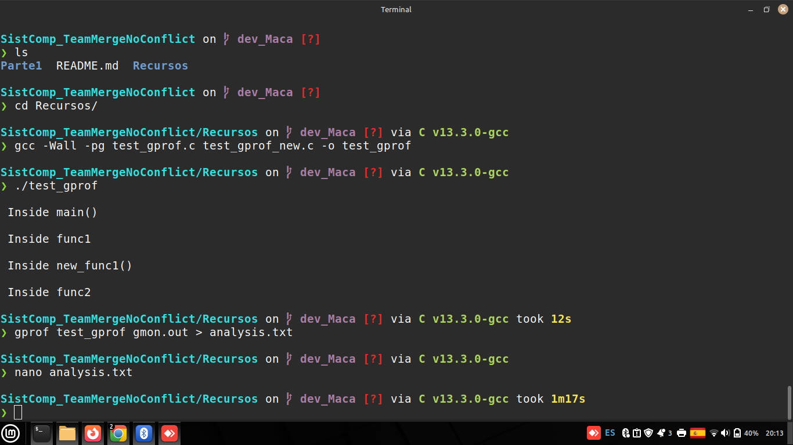
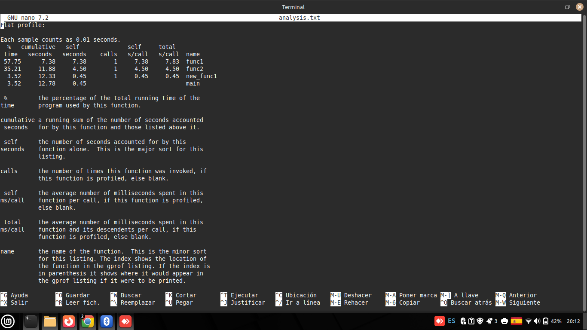
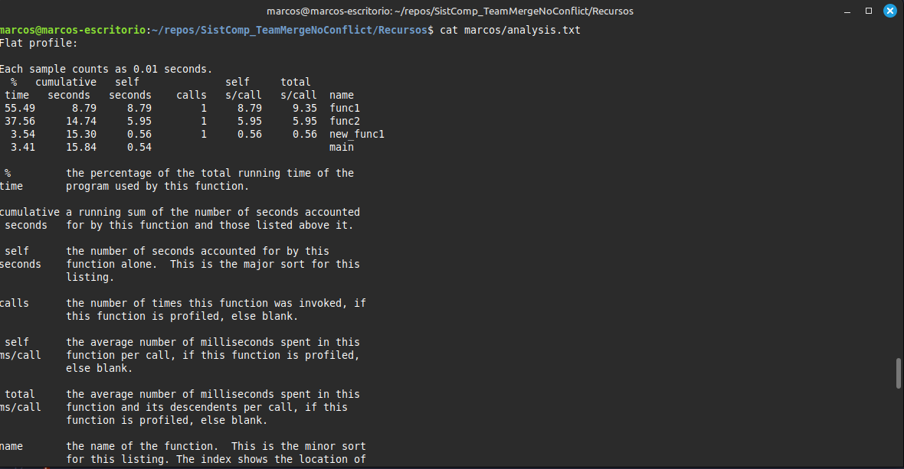

## **Segunda Parte**

## Time Profiling

Realizamos una prueba con **gprof**, un perfilador clásico que utiliza la técnica de inyección de código. Al compilar el programa con banderas específicas, gprof inserta código adicional para medir el tiempo de ejecución de las funciones. Luego, al ejecutarlo, genera un archivo de datos que se analiza para producir un informe detallado sobre el tiempo de CPU consumido por cada parte del programa. Con esta herramienta vamos a poder validar experimentalmente la eficiencia de nuestro código y detectar áreas de mejora.

---

### Paso 1 - Crear programa para pruebas

Para esta prueba utilizaremos los siguientes archivos de código en C.

```c
// test_gprof.c
#include <stdio.h>

void new_func1(void);

void func1(void)
{
    printf("\n Inside func1 \n");
    int i = 0;

    for (; i < 0xffffffff; i++);
    new_func1();

    return;
}

static void func2(void)
{
    printf("\n Inside func2 \n");
    int i = 0;

    for (; i < 0xafffffff; i++);
    return;
}

int main(void)
{
    printf("\n Inside main()\n");
    int i = 0;

    for (; i < 0xfffff11; i++);
    func1();
    func2();

    return 0;
}
```

```c
// test_gprof_new.c
#include <stdio.h>

void new_func1(void)
{
    printf("\n Inside new_func1()\n");
    int i = 0;

    for (; i < 0xfffff66; i++);

    return;
}
```

Claramente este código solo es un ejemplo que busca generar tareas arbitrarias (bucles `for`) para mantener la CPU ocupada artificialmente. De esta manera podemos medir el tiempo que cada función consume sin que la lógica del programa interfiera en el análisis.

---

### Paso 2 - Compilar con opción de profiling

Para realizar las pruebas con gprof debemos compilar el código usando `gcc` con la opción `-pg`, que genera código extra para guardar información de profiling en un formato que gprof puede utilizar. La compilación se realiza de la siguiente manera:

```bash
gcc -pg test_gprof.c test_gprof_new.c -o test_gprof
```

Una vez compilado el programa lo ejecutamos normalmente:

```bash
./test_gprof
```

Notaremos que al finalizar la ejecución aparecerá un nuevo archivo `gmon.out` en el directorio. Este archivo contiene la información de profiling recolectada en tiempo de ejecución, que será utilizada por gprof en el siguiente paso.

> **Nota:** La opción `-pg` agrega llamadas a rutinas especiales de profiling al inicio y al final de cada función, por lo que el binario resultante puede ejecutarse levemente más lento que sin esta opción.




---

### Paso 3 - Obtener resultados

Para poder ver los resultados del archivo `gmon.out`, ejecutamos el comando `gprof` indicando como parámetros el ejecutable compilado y el archivo de datos:

```bash
gprof test_gprof gmon.out
```

Adicionalmente podemos redirigir la salida a un archivo de texto para analizarla con mayor comodidad:

```bash
gprof test_gprof gmon.out > analysis.txt
```

En este caso de ejemplo, con un procesador Intel(R) Core(TM) i3-8130U CPU @ 2.20GHz-16GB DDR4 3200MHz
Los elementos de la tabla son: 

- **% time**: El porcentaje del tiempo total de ejecución que el programa usó en esa función.
- **cumulative seconds**: La suma del tiempo de ejecución de la función y las funciones que se encuentran por encima de esta en la tabla.
- **self seconds**: Tiempo en segundos que se estuvo ejecutando la función exclusivamente.
- **calls**: Número de veces que la función fue llamada durante la ejecución.
- **self s/call**: Promedio de segundos gastados en esta función por llamada. Dado que todas las funciones se llamaron 1 sola vez, este valor es igual a *self seconds*.
- **total s/call**: Promedio en segundos gastados en esta función y sus descendientes. Nótese que para `func1` esto incluye el tiempo en `func1` más el tiempo en `new_func1`.

Además de esta tabla, gprof también provee una segunda tabla con datos similares donde podemos ver el tiempo gastado en cada función y sus funciones "hijas":


_Figura 1: Caso del procesador Intel(R) Core(TM) i3-8130U CPU @ 2.20GHz-16GB DDR4 3200MHz_
Donde:
- **self**: tiempo gastado en la función en sí misma.
- **children**: tiempo total acumulado en sus funciones hijas.
- **called**: número de veces que la función padre llamó a la hija / el total de veces que la función hija fue llamada.

A continuación se muestran los resultados obtenidos con el mismo código pero diferentes procesadores, para comparar el impacto del hardware en el tiempo de ejecución:




_Figura 2: Caso del procesador AMD Ryzen 5 1600AF @ 3.20GHz/3.60Ghz - 16GB DDR4 3200MHz_


_Figura 3: Caso del procesador 12th Gen Intel(R) Core(TM) i5-12500H (2.50 GHz)_


--- 
### Conclusiones del Time Profiling

El análisis con gprof nos permitió observar con precisión qué funciones consumen mayor tiempo de CPU. En este ejemplo:

- `func1` resultó ser la más costosa en términos de tiempo acumulado, ya que además de su propio bucle, incluye la llamada a `new_func1`.
- `func2` también tiene un tiempo de ejecución elevado, aunque su bucle es ligeramente menor que el de `func1`.
- `main` tiene el menor tiempo propio, ya que su bucle es el más corto de los tres.

Esta herramienta es especialmente útil en proyectos reales para identificar *hotspots*, es decir, funciones que consumen desproporcionadamente más tiempo que el resto, y así priorizar optimizaciones donde realmente tienen impacto.

---
