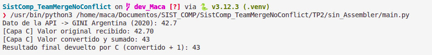
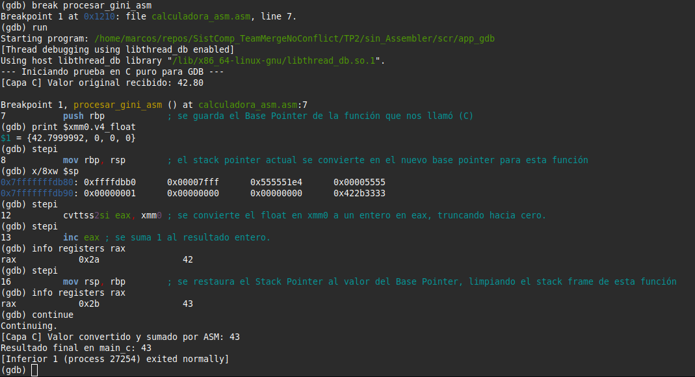

# Informe: Trabajo Práctico #2 - Arquitectura de Capas (Iteración 1)

**Asignatura:** Sistemas de Computación  
**Institución:** Facultad de Ciencias Exactas, Físicas y Naturales (FCEFyN) – UNC  
**Docente:** Javier Alejandro Jorge  

## Datos del Grupo y Repositorio

* **Integrantes:** 
  - Macarena Vanina González 
  - Marcos Nieto 
  - Mario Pampiglione
* **Repositorio:** [https://github.com/Maca040/SistComp_TeamMergeNoConflict.git](https://github.com/Maca040/SistComp_TeamMergeNoConflict.git)

## 1. Introducción y Arquitectura
Este trabajo práctico aborda el diseño de una aplicación distribuida en capas para procesar datos socioeconómicos reales. La arquitectura se compone de:
* **Capa Superior (Python):** Gestiona la obtención de datos desde la API REST.
* **Capa Intermedia (C):** Actúa como puente y gestiona la convención de llamadas.
* **Capa Inferior (Assembler):** Realiza el procesamiento a nivel de hardware.

## 2. Implementación Técnica: Iteración 1 (Python y C)

En la primera instancia, se implementó una solución que recupera el índice GINI de Argentina desde la API REST del Banco Mundial y lo procesa mediante una librería dinámica compilada en C.

### 2.1 Archivos de la Iteración 1
* **`main.py`**: Es el script principal que consume la API del Banco Mundial, busca el último índice GINI válido de Argentina y utiliza el módulo `ctypes` para invocar la librería en C y enviarle el valor.
* **`calculadora.c`**: Inicialmente (Iteración 1), este archivo recibía el valor flotante, realizaba el casteo a entero y sumaba +1. 
* **`libcalculadora.so`**: Es el archivo objeto compartido (librería dinámica) generado tras compilar la capa C para que Python la ejecute.

Para demostrar la correcta comunicación y el pasaje de parámetros, adjuntamos la salida por consola original:

---

## 3. Implementación Técnica: Iteración 2 (Ensamblador y Stack)

Para la segunda iteración, se modificó la arquitectura delegando el procesamiento matemático a una rutina en lenguaje Ensamblador, dejando a C exclusivamente como puente.

### 3.1 Nuevos Archivos de la Iteración 2
* **`calculadora_asm.asm`**: Rutina en ensamblador que recibe el flotante en el registro `xmm0` (System V ABI), lo convierte a entero truncado (`cvttss2si`), le suma una unidad (`inc eax`) y devuelve el resultado. Implementa el correcto armado y desarmado del Stack Frame.
* **`main_c.c` y `app_gdb`**: Un programa en C puro y su ejecutable para aislar la capa inferior y validar el comportamiento de la memoria sin la intervención de Python.

### 3.2 Validación con GDB
Se utilizó el ejecutable de C puro (`app_gdb`) para validar el comportamiento de la pila y los registros en GDB. Se comprobó la correcta ejecución instrucción por instrucción (`stepi`), validando:
1. El armado del Stack Frame (`push rbp`).
2. El correcto pasaje del registro matemático (de `0x2a` a `0x2b` tras el `inc eax`).
3. La correcta limpieza de la pila al retornar.

 

## Bibliografía
* Guía rápida para uso del debugger GDB - Departamento de Computación FCEFyN.
* Enunciado TP#2: Calculadora de índices GINI - Javier Jorge.