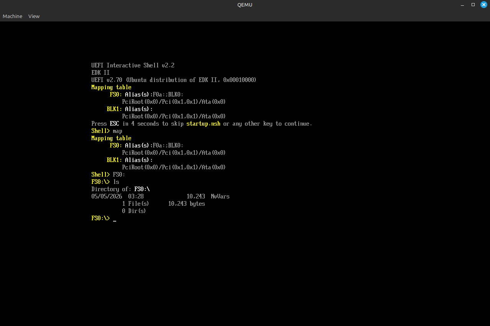
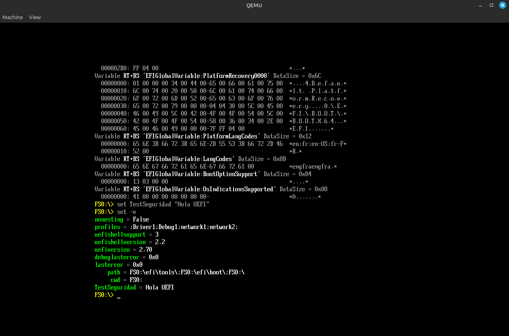
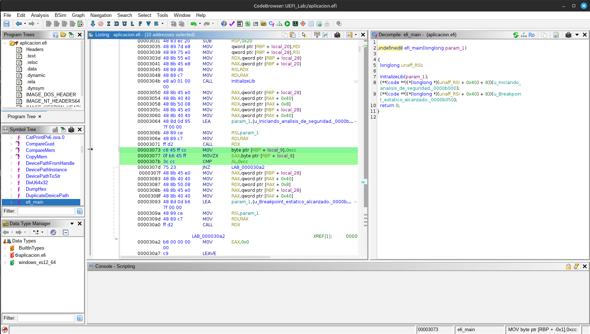
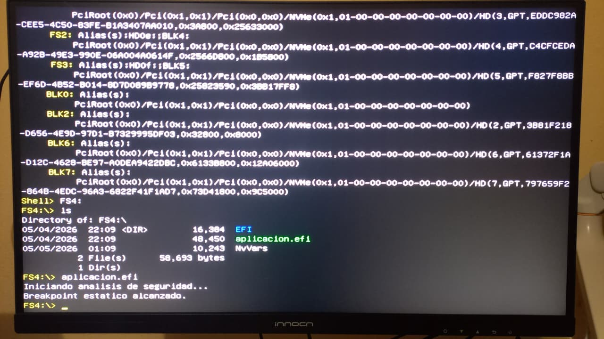

# Informe: Trabajo Práctico #3.a - UEFI

**Asignatura:** Sistemas de Computación  
**Institución:** Facultad de Ciencias Exactas, Físicas y Naturales (FCEFyN) – UNC  
**Docente:** Javier Alejandro Jorge  

## Datos del Grupo y Repositorio

* **Integrantes:** 
  - Macarena Vanina González 
  - Marcos Nieto 
  - Mario Pampiglione
* **Repositorio:** [https://github.com/Maca040/SistComp_TeamMergeNoConflict.git](https://github.com/Maca040/SistComp_TeamMergeNoConflict.git)

---

## Introducción

Este trabajo práctico tiene como objetivo comprender la arquitectura de la Interfaz de Firmware Extensible Unificada (UEFI) como un entorno pre-sistema operativo. A lo largo del informe, detallamos la preparación de un entorno virtual para pruebas, el desarrollo de binarios nativos (PE/COFF), su formato interno, y finalmente, la ejecución en hardware físico (bare metal) sorteando las restricciones de arranque seguro.

## 1. Exploración del Entorno UEFI y la Shell (Parte 1)

Se exploró cómo UEFI abstrae el hardware y gestiona la configuración antes de la carga del SO. A diferencia del BIOS Legacy que simplemente leía el primer sector del disco (MBR), UEFI despliega un entorno completo con su propio gestor de memoria, red y consola.

Al utilizar la UEFI Shell, exploramos el mapeo de dispositivos con comandos como `map` y `dh -b`. 

> **Pregunta 1: Al ejecutar el comando map y dh, vemos protocolos e identificadores en lugar de puertos de hardware fijos. ¿Cuál es la ventaja de seguridad y compatibilidad de este modelo frente al antiguo BIOS?**
>
> **Respuesta:** El modelo de protocolos abstrae el hardware físico. El firmware o un binario UEFI puede interactuar con un disco o tarjeta de red usando una interfaz estándar (API) sin necesidad de saber si el dispositivo está conectado por SATA, USB o PCIe. Esto previene conflictos de hardware y facilita un desarrollo mucho más seguro y portable.

Luego analizamos las variables globales no volátiles (NVRAM) y el footprinting de memoria.

> **Pregunta 2: Observando las variables Boot#### y BootOrder, ¿cómo determina el Boot Manager la secuencia de arranque?**
>
> **Respuesta:** El Boot Manager lee primero el arreglo almacenado en `BootOrder` (por ejemplo, 0000, 0002). Luego, busca la variable correspondiente a ese orden (como `Boot0000`) y lee la ruta del dispositivo (*Device Path*) que apunta al ejecutable `.efi` específico que debe iniciar.

> **Pregunta 3: En el mapa de memoria (`memmap`), existen regiones marcadas como `RuntimeServicesCode`. ¿Por qué estas áreas son un objetivo principal para los desarrolladores de malware (Bootkits)?**
>
> **Respuesta:** A diferencia de la memoria `BootServices`, las regiones `RuntimeServices` no se borran cuando el sistema operativo (Linux/Windows) toma el control. Un Bootkit inyectado en estas áreas garantiza su persistencia en memoria operando con máximos privilegios (Anillo -2 / SMM) de forma completamente invisible para el antivirus del SO.

---

## 2. Desarrollo, Compilación y Análisis de Seguridad (Parte 2)

Se desarrolló una aplicación nativa UEFI en lenguaje C (`aplicacion.c`) inyectando un breakpoint estático (INT3 - `0xCC`) para analizar el comportamiento a bajo nivel. 

> **Pregunta 4: ¿Por qué utilizamos `SystemTable->ConOut->OutputString` en lugar de la función estándar `printf` de C?**
>
> **Respuesta:** Porque en el entorno Pre-OS de UEFI no existe un kernel de sistema operativo en ejecución, ni tampoco la biblioteca estándar de C (`libc`). Por lo tanto, toda la entrada y salida de datos debe hacerse a través de los protocolos expuestos por la `SystemTable` proveída por el firmware.

La aplicación fue compilada para generar un binario de código objeto, enlazada para generar un `.so` y luego convertida a ejecutable EFI (`aplicacion.efi`) utilizando el formato de ejecutables PE/COFF típico de Windows.

Tras realizar la decompilación del binario EFI con **Ghidra**, analizamos las instrucciones a nivel del firmware:

> **Pregunta 5: En el pseudocódigo de Ghidra, la condición `0xCC` suele aparecer como `-52`. ¿A qué se debe este fenómeno y por qué importa en ciberseguridad?**
>
> **Respuesta:** Esto se debe a la representación de los números en complemento a dos. El byte `0xCC` (204 en decimal sin signo), cuando es interpretado por el descompilador como un tipo de dato con signo de 8 bits (signed char), resulta en `-52`. En ciberseguridad, identificar correctamente si un byte es tratado con o sin signo es vital, ya que un casteo o interpretación errónea al decompilar puede llevar a malinterpretar las condiciones del software, ocultando vulnerabilidades u opcodes maliciosos (como nuestro breakpoint `INT3`).

---

## 3. Ejecución en Hardware Físico - Bare Metal (Parte 3)

Para sortear las restricciones del entorno virtual, se trasladó el binario compilado a una computadora real.

### Preparación del medio
Se formateó un pendrive en **FAT32** (requerimiento estricto de la especificación UEFI) y se generó la estructura de directorios estándar (`/EFI/BOOT/`). Allí se ubicó la UEFI Shell oficial de TianoCore (`BOOTX64.EFI`) junto con la aplicación nativa desarrollada en el paso anterior (`aplicacion.efi`).

### Ejecución y Evasión del Secure Boot
Dado que nuestro binario de la Shell y la aplicación no están firmados criptográficamente por una entidad reconocida (como Microsoft), el firmware rechazaría la ejecución devolviendo un error de violación de seguridad. 

Para sortear esta restricción:
1. Se accedió a la configuración del BIOS/UEFI.
2. Se desactivó el **Secure Boot** (`Disabled`).
3. Se garantizó el modo de arranque en **UEFI Only**.

Al reiniciar el equipo y bootear desde el USB, la UEFI Shell tomó control del equipo. Finalmente, ejecutamos nuestro binario accediendo al file system `FS0:\` y ejecutando `aplicacion.efi`.

**Resultado en pantalla (Fuera del SO):**

## Conclusión

El desarrollo de aplicaciones a nivel de firmware es un proceso altamente sensible a la arquitectura. Durante este trabajo práctico, quedó en evidencia que la transición de un entorno teórico a la ejecución real en *Bare Metal* requiere un conocimiento profundo de cómo interactúa el software a muy bajo nivel.

Para lograr una ejecución estable y sin cuelgues, **fue indispensable refactorizar el código fuente en C propuesto originalmente en la guía**. Las adaptaciones más críticas que se llevaron a cabo nos dejaron grandes aprendizajes:

1. **Compatibilidad de ABI (Application Binary Interface):** Fue imperativo incorporar la macro `EFIAPI` en la función principal. Esto resolvió una incompatibilidad crítica entre la convención de llamadas nativa del compilador en Linux (*System V ABI*) y la que espera el firmware UEFI (*Microsoft ABI*), evitando la corrupción de la tabla de punteros y los consecuentes *Page Faults* que colgaban el sistema.
2. **Manejo Estricto de Tipos (Type Promotion):** La resolución de la falla lógica en la evaluación del *breakpoint* (`0xCC`) demostró cómo la promoción implícita de tipos en C puede introducir comportamientos anómalos silenciosos (interpretando el byte como el valor negativo `-52`). Esto reafirma por qué en ciberseguridad es vital el control absoluto sobre los tipos de datos mediante *casting* explícito.

Más allá de haber cumplido con el objetivo de ejecutar código nativo y esquivar el *Secure Boot*, lo más valioso que nos llevamos de este TP fue la práctica real de *troubleshooting*. Nos sirvió muchísimo para entender cómo funciona la memoria a tan bajo nivel, mucho antes de que el sistema operativo siquiera arranque.
